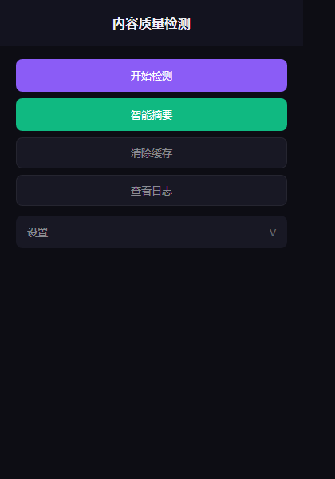
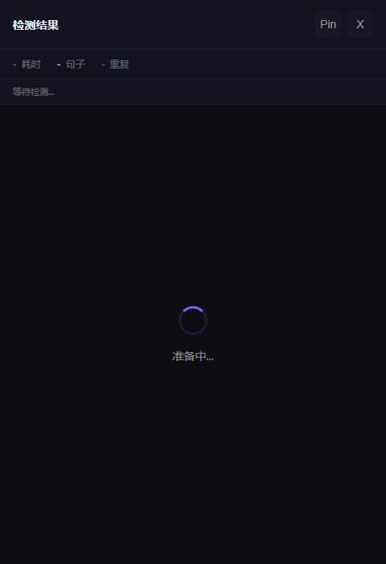
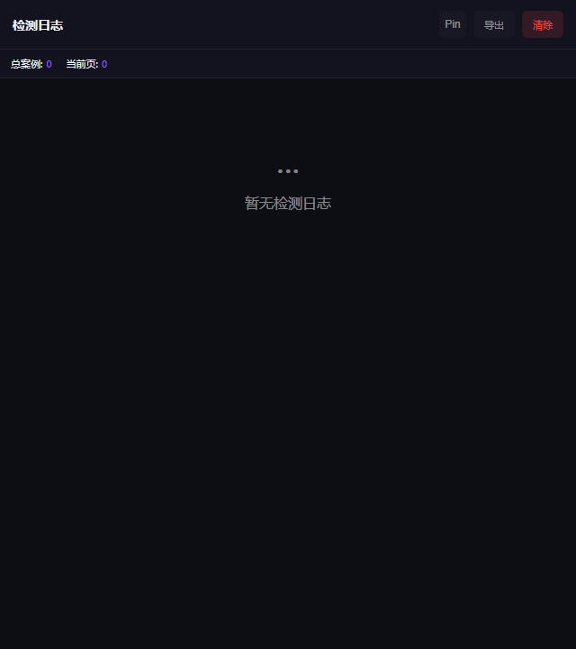

# 内容质量检测 Chrome 插件

检测网页正文的语义重复段落，支持 AI 智能摘要，让内容编辑更高效。



## 功能特性

### 1. 内容检测
- 自动提取网页正文段落
- 本地关键词算法快速预检测（日期/数字/书名号/核心词）
- MiniMax API 语义分析精筛
- 智能识别语义重复句子对

### 2. AI 智能摘要
- 一键生成文章摘要
- 流式输出快速响应

### 3. 快速定位
- 点击定位按钮，滚动到原网页对应位置
- 永久红色边框高亮标记

### 4. 案例日志
- 记录历史检测案例
- 支持导出分享
- 最多保存 50 条记录

## 界面预览

### Popup 窗口
支持开始检测、智能摘要、设置面板


### Panel 窗口
展示检测结果、统计信息、定位按钮



### Logs 窗口
查看历史案例、导出日志



## 技术栈

- Chrome Extension (Manifest V3)
- JavaScript ES6+
- MiniMax API (语义分析)
- 本地关键词算法 (预检测)

## 安装

1. 克隆仓库到本地
2. 打开 Chrome `chrome://extensions/`
3. 开启右上角「开发者模式」
4. 点击「加载已解压的扩展程序」
5. 选择项目中的 `chrome-extension` 文件夹

## 使用方法

### 快速开始

1. 点击 Chrome 工具栏中的插件图标
2. 打开任意新闻/文章页面
3. 点击「开始检测」分析内容重复
4. 或点击「智能摘要」生成文章摘要
5. 在结果面板查看重复句子对
6. 点击定位按钮查看原文对应位置

### 配置 API Key

1. 点击「设置」
2. 输入 MiniMax API Key
3. 点击「保存」

> 获取 API Key：https://platform.minimaxi.com/

## 项目结构

```
chrome-extension/
├── manifest.json     # 扩展配置
├── popup.html        # 弹出窗口主界面
├── popup.js          # 弹出窗口逻辑
├── panel.html        # 结果面板主界面
├── panel.js          # 结果面板逻辑
├── background.js     # 后台脚本 (Service Worker)
├── content.js        # 内容脚本 (注入目标页面)
├── logs.html         # 日志查看页面
├── logs.js           # 日志处理逻辑
└── icons/            # 插件图标
```

## 核心架构

```
┌─────────────┐     ┌─────────────────┐     ┌─────────────┐
│   Popup     │────>│  Service Worker │────>│   Panel    │
│  (触发器)   │     │  (后台处理)      │     │  (结果展示) │
└─────────────┘     └─────────────────┘     └─────────────┘
                           │
                           ▼
                    ┌─────────────┐
                    │ Content.js  │
                    │ (注入页面)  │
                    └─────────────┘
```

## 算法流程

```
1. Content Script 提取网页正文句子
2. 本地关键词算法预检测（<5秒）
   - 日期/数字/书名号/核心词提取
   - Jaccard 相似度计算
   - 筛选候选句对
3. MiniMax API 语义分析
   - 仅对候选对调用 API
   - 流式输出响应
4. Panel 展示检测结果
```

## 技术亮点

- **双窗口架构**：popup 触发 + panel 展示，数据通过 storage 共享
- **异步非阻塞**：Service Worker 执行，不依赖 popup 窗口焦点
- **本地预检测**：减少 90% API 调用量，检测速度提升 180 倍
- **核心要素组合**：日期+作品名+核心词多维度匹配，降低 60% 误报率

## License

MIT